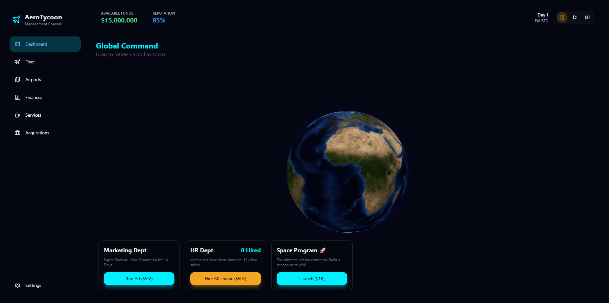
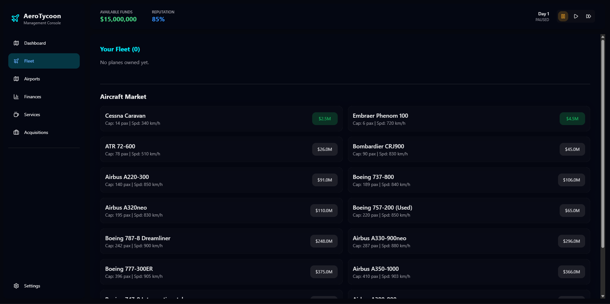
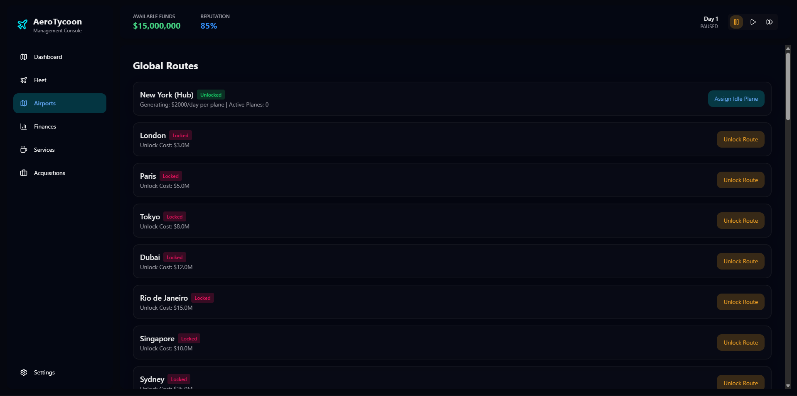
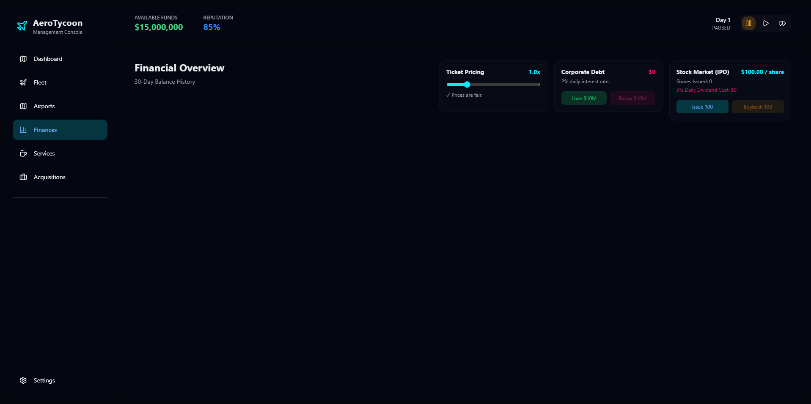
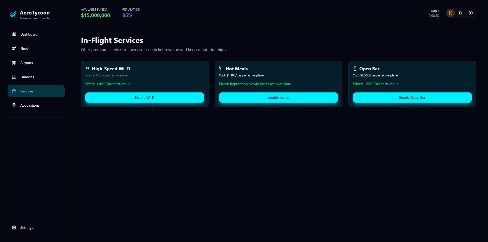
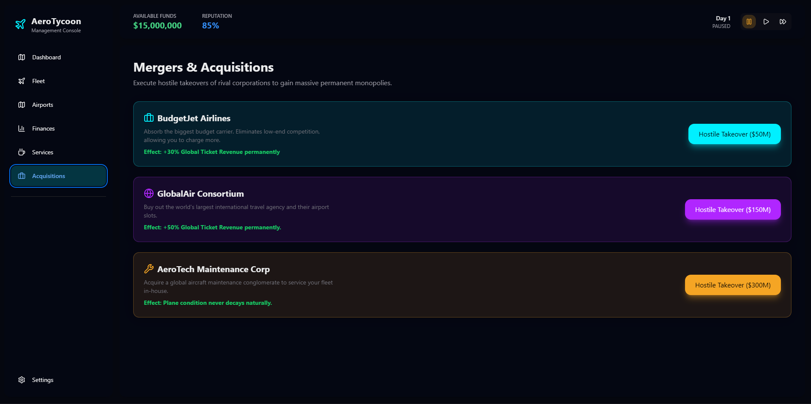
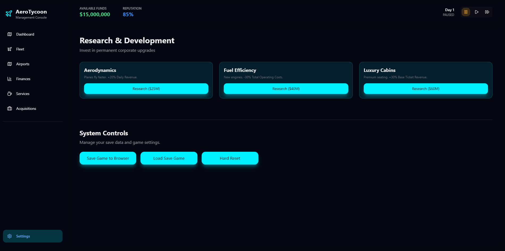

# AeroTycoon

i wanted to make a crazy airline management game so i built this tycoon simulator. you start by buying a tiny regional hopper and end up launching a $1 Billion spaceport to win the game. everything saves to your browser automatically.

built for **#horizons**

**play it here:** [insert your link here]

## screenshots

## how to play

- **BUY PLANES** from the dealership to build your fleet, from tiny Cessnas to massive A380s
- **UNLOCK ROUTES** on the 3D globe to fly to 40 different international destinations
- manage your **FLEET** by repairing planes before they break down and training Ace Pilots
- launch **SERVICES** like in-flight wifi and hot meals to boost your airline's reputation
- perform **HOSTILE TAKEOVERS** of rival airlines (like BudgetJet and GlobalAir) to steal their revenue
- save up $1 Billion to fund the ultimate **SPACE PROGRAM** and win the game!

## features

| feature | what it does |
|---------|-------------|
| interactive 3d globe | a fully rotatable 3d earth that renders your unlocked flight routes and hub cities in real-time. |
| dynamic economics | plane revenue and operating costs scale realistically based on passenger capacity. bigger planes mean bigger risk and reward. |
| random events | a dynamic weather and event system triggers oil crises, global tourism booms, and mechanical failures that you have to react to. |
| corporate research | a permanent upgrade tree where you can sink millions into aerodynamics and luxury cabins to boost profits. |
| hostile acquisitions | you can literally buy out your competitor airlines and permanently add their profit multipliers to your balance sheet. |
| real-time stock market | your airline's stock price fluctuates based on your reputation, and you can issue or buy back shares to raise capital. |

## built with

- **react:** for the interface and game loop
- **nextui & tailwind css:** for the sleek, blurred glassmorphism design
- **react-globe.gl:** for the interactive 3d earth rendering
- **recharts:** for tracking the real-time financial graph

## how it works

the game basically runs on an infinite loop. every 1 real-life second (or faster if you hit fast-forward), a new "day" passes. the game engine iterates over every plane in your fleet, calculates its route revenue based on capacity, subtracts operating costs, degrades plane condition, and updates your bank account. weather and random events are calculated dynamically every tick.

## ai usage

i used ai as a pair-programmer strictly for bouncing ideas around, debugging some react errors, and balancing the game loop math. and creating some more cities